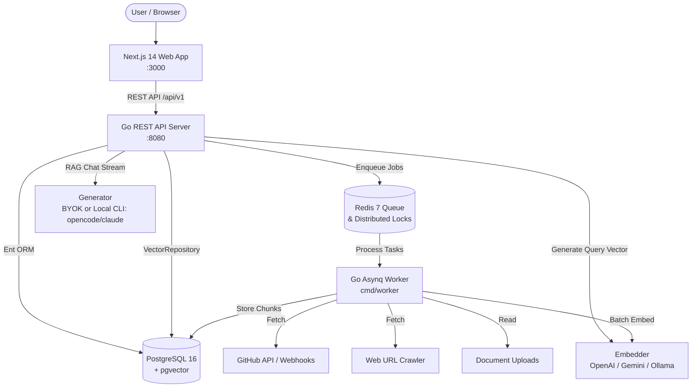

# ContextForge

> Open-source, self-hostable, project-scoped RAG knowledge platform for turning GitHub repositories, pull requests, issues, URLs, and documents into searchable AI knowledge bases with grounded answers and verifiable citations.

[](https://opensource.org/licenses/Apache-2.0)
[](https://go.dev/)
[](https://nextjs.org/)
[](https://github.com/pgvector/pgvector)

---

## 🌟 Key Highlights

- **Strict Project Isolation**: Every retrieval operation enforces `WHERE project_id = $project_id` during vector scans. Project boundaries are hard multi-tenant security barriers. Cross-project data leakage is architecturally impossible.
- **Deduplicated Repository Ingestion**: Canonical external repository identities are shared across projects while keeping indexed vector chunks strictly project-isolated. Distributed Redis locks prevent duplicate concurrent git clones/fetches, and SHA-256 content hashing eliminates redundant re-embedding.
- **Asynchronous Ingestion Workers**: Long-running ingestion never blocks HTTP request cycles. Background workers powered by **Asynq** and **Redis** process prioritized queues (`critical`, `default`, `low`) with progress reporting and cancellation propagation.
- **Incremental Synchronization**: Automatically tracks git commit SHAs and GitHub Compare API deltas (`/compare/{base}...{head}`). Only new or modified files are embedded; deleted files are purged; unchanged files incur zero LLM/embedding cost.
- **Bring Your Own Key (BYOK) & CLI Subscriptions**:
  - **BYOK Cloud Providers**: OpenAI (`text-embedding-3-small`, `gpt-4o-mini`), Google Gemini (`text-embedding-004`, `gemini-1.5-flash`), Anthropic (`claude-3-5-sonnet`).
  - **Local Zero-Cost Embeddings**: Ollama (`nomic-embed-text`) or fast in-process embeddings.
  - **Local Developer CLI Bridges**: Seamlessly connects to your locally authenticated CLI subscriptions (`opencode` with OpenCode Go subscription, `claudecode`, `gemini cli`, `codex`) via non-interactive subshell execution and SSE streaming.
- **Structured, Verifiable Citations**: RAG responses map inline markers (e.g. `[^1]`) directly to structured citation metadata, including repository, branch, commit SHA, file path, line numbers, and exact text quotes. Ungrounded citations are rejected.
- **Production-Grade Engineering**:
  - **Ent ORM** (`entgo.io/ent`) for strongly typed database schemas and graph traversal.
  - **pgvector Repository**: All vector similarity searches (`<=>`) are encapsulated behind a dedicated `VectorRepository` interface.
  - **Versioned Migrations**: Managed via `golang-migrate` with bidirectional (`up`/`down`) SQL scripts.
  - **OpenAPI 3.1 First**: Live interactive API documentation served at `/api/docs`.

---

## 🏗 High-Level Architecture



---

## 🚀 Getting Started

### Prerequisites

- **Docker** and **Docker Compose**
- **Go 1.22+** (for host-mode development)
- **Node.js 20+** (for frontend development)
- One of:
  - Local AI CLI tool (e.g. `opencode`, `claude`, `gemini`) logged in on host
  - OR a cloud API key (`OPENAI_API_KEY`, `GEMINI_API_KEY`, or `ANTHROPIC_API_KEY`)
  - OR local Ollama (`ollama serve`)

---

### Quickstart: Host-CLI Bridge Development Profile

This recommended profile runs PostgreSQL and Redis in Docker while running the Go API, worker, and Next.js web app on your host machine to directly leverage your host CLI subscriptions (`opencode`, `claude`, etc.):

```bash
# 1. Clone repository
git clone https://github.com/unknownjedi/contextforge.git
cd contextforge

# 2. Configure environment
cp .env.example .env
# Edit .env to set your GITHUB_PAT and select your LLM_PROVIDER (e.g. opencode-cli)

# 3. Start database and queue infrastructure
make dev-infra

# 4. Run database migrations
make migrate-up

# 5. Start the API server, worker, and web app
# In terminal 1:
make dev-api

# In terminal 2:
make dev-worker

# In terminal 3:
make dev-web
```

Open [http://localhost:3000](http://localhost:3000) in your browser.

---

### Alternative: Full Containerized Stack

To run the entire system in isolated Docker containers:

```bash
docker compose up --build
```

Access:
- Web Application: [http://localhost:3000](http://localhost:3000)
- REST API Server: [http://localhost:8080](http://localhost:8080)
- Interactive API Documentation: [http://localhost:8080/api/docs](http://localhost:8080/api/docs)

---

## 🧪 Testing & Verification

ContextForge enforces a multi-tier testing strategy:

```bash
# Run unit tests
make test-unit

# Run integration tests against real Postgres+pgvector & Redis
make test-integration

# Run the non-negotiable Cross-Project Isolation test
make test-isolation

# Run static analysis and linter
make lint

# Run vulnerability audit
make security
```

---

## 📚 Documentation Index

- **Architecture**:
  - [Overview](docs/architecture/overview.md)
  - [Diagrams](docs/architecture/diagrams.md)
  - [Data Flow](docs/architecture/data-flow.md)
  - [Deployment](docs/architecture/deployment.md)
- **Security & Threat Model**:
  - [STRIDE Threat Model](docs/security/threat-model.md)
  - [Security Controls & Invariants](docs/security/security-controls.md)
  - [Security Disclosure Policy](SECURITY.md)
- **RAG & Retrieval**:
  - [RAG Architecture](docs/rag/architecture.md)
  - [Retrieval & Vector Search](docs/rag/retrieval.md)
  - [Ingestion Pipeline](docs/rag/ingestion.md)
  - [Evaluation Suite](docs/rag/evaluation.md)
- **Architecture Decision Records (ADRs)**:
  - [ADR-0001: Go Backend and Chi Router](docs/adr/0001-go-backend.md)
  - [ADR-0002: PostgreSQL 16 + pgvector](docs/adr/0002-postgresql-pgvector.md)
  - [ADR-0003: GitHub App & PAT Fallback](docs/adr/0003-github-app.md)
  - [ADR-0004: Asynchronous Ingestion via Asynq & Redis](docs/adr/0004-async-ingestion.md)
  - [ADR-0005: Mandatory Project-Scoped Data Isolation](docs/adr/0005-project-isolation.md)
  - [ADR-0006: API-First Architecture & OpenAPI 3.1](docs/adr/0006-api-first.md)
  - [ADR-0007: Ent ORM & Data Access](docs/adr/0007-database-access-layer.md)
  - [ADR-0008: Pluggable AI Providers & CLI Subscription Bridges](docs/adr/0008-llm-embedding-providers.md)
  - [ADR-0009: Encapsulating pgvector in VectorRepository](docs/adr/0009-pgvector-repository-pattern.md)
  - [ADR-0010: Database Migration Management](docs/adr/0010-database-migrations.md)
- **Task System**:
  - [Implementation Plan Backlog](docs/implementation-plan.md)

---

## 📄 License

ContextForge is licensed under the [Apache License 2.0](https://www.apache.org/licenses/LICENSE-2.0). See the [LICENSE](./LICENSE) / [LICENSE.md](./LICENSE.md) file for details.
