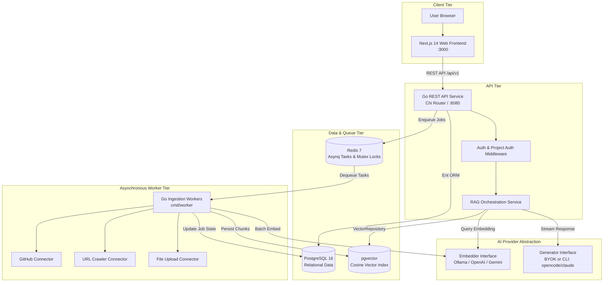
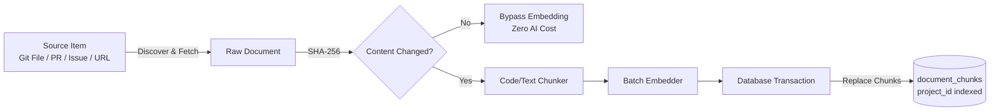
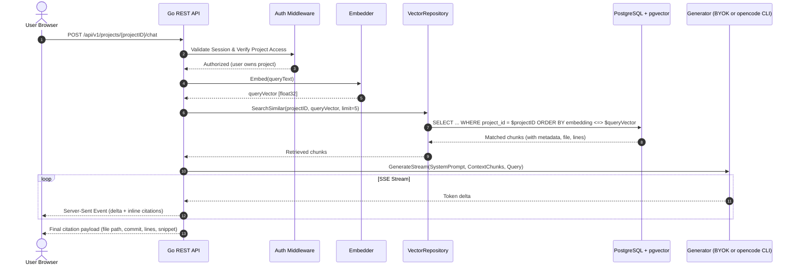

# ContextForge Architecture Diagrams

## 1. System Topology

```mermaid
flowchart TD
    subgraph Client Tier
        UserBrowser[User Browser]
        NextApp[Next.js 14 Web Frontend\n:3000]
    end

    subgraph API Tier
        GoAPI[Go REST API Service\nChi Router / :8080]
        AuthMiddleware[Auth & Project Auth Middleware]
        RAGOrchestrator[RAG Orchestration Service]
    end

    subgraph Data & Queue Tier
        Postgres[(PostgreSQL 16\nRelational Data)]
        PgVector[(pgvector\nCosine Vector Index)]
        RedisQueue[(Redis 7\nAsynq Tasks & Mutex Locks)]
    end

    subgraph Asynchronous Worker Tier
        WorkerPool[Go Ingestion Workers\ncmd/worker]
        GHConnector[GitHub Connector]
        URLConnector[URL Crawler Connector]
        FileConnector[File Upload Connector]
    end

    subgraph AI Provider Abstraction
        Embedder[Embedder Interface\nOllama / OpenAI / Gemini]
        Generator[Generator Interface\nBYOK or CLI: opencode/claude]
    end

    UserBrowser --> NextApp
    NextApp -->|REST API /api/v1| GoAPI
    GoAPI --> AuthMiddleware
    AuthMiddleware --> RAGOrchestrator

    RAGOrchestrator -->|VectorRepository| PgVector
    RAGOrchestrator -->|Query Embedding| Embedder
    RAGOrchestrator -->|Stream Response| Generator

    GoAPI -->|Ent ORM| Postgres
    GoAPI -->|Enqueue Jobs| RedisQueue

    RedisQueue -->|Dequeue Tasks| WorkerPool
    WorkerPool --> GHConnector
    WorkerPool --> URLConnector
    WorkerPool --> FileConnector

    WorkerPool -->|Batch Embed| Embedder
    WorkerPool -->|Persist Chunks| PgVector
    WorkerPool -->|Update Job State| Postgres
```

## 2. Ingestion Pipeline Lifecycle

```mermaid
flowchart LR
    Source[Source Item\nGit File / PR / Issue / URL] -->|Discover & Fetch| RawDoc[Raw Document]
    RawDoc -->|SHA-256| HashCheck{Content Changed?}
    HashCheck -- No --> Skip[Bypass Embedding\nZero AI Cost]
    HashCheck -- Yes --> Chunker[Code/Text Chunker]
    Chunker --> EmbedBatch[Batch Embedder]
    EmbedBatch --> StorageTx[Database Transaction]
    StorageTx -->|Replace Chunks| PgVector[(document_chunks\nproject_id indexed)]
```

## 3. Project-Scoped RAG Query Flow

```mermaid
sequenceDiagram
    autonumber
    actor User as User Browser
    participant API as Go REST API
    participant Middleware as Auth Middleware
    participant Embed as Embedder
    participant Repo as VectorRepository
    participant DB as PostgreSQL + pgvector
    participant LLM as Generator (BYOK or opencode CLI)

    User->>API: POST /api/v1/projects/{projectID}/chat
    API->>Middleware: Validate Session & Verify Project Access
    Middleware-->>API: Authorized (user owns project)
    API->>Embed: Embed(queryText)
    Embed-->>API: queryVector [float32]
    API->>Repo: SearchSimilar(projectID, queryVector, limit=5)
    Repo->>DB: SELECT ... WHERE project_id = $projectID ORDER BY embedding <=> $queryVector
    DB-->>Repo: Matched chunks (with metadata, file, lines)
    Repo-->>API: Retrieved chunks
    API->>LLM: GenerateStream(SystemPrompt, ContextChunks, Query)
    loop SSE Stream
        LLM-->>API: Token delta
        API-->>User: Server-Sent Event (delta + inline citations)
    end
    API-->>User: Final citation payload (file path, commit, lines, snippet)
```
